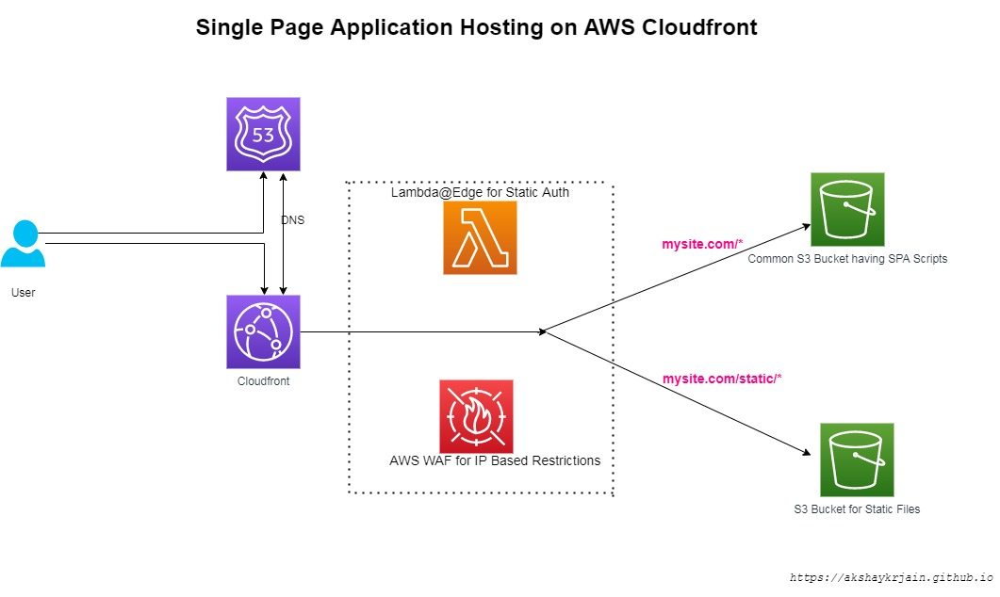

# Deploy A Single Page Static Application on AWS CloudFront Distribution using Terraform

> A Terraform Module which will deploy a SPA on AWS CloudFormation backed by S3 Buckets

## High-Level Architecture Diagram



## Security Features and best practices used:
### S3 Bucket : 
- Private 
- Encrypted 
- Versioning Enabled
### DNS : 
- Bring your own domain 
- DNS Records manageable in AWS Route53
- Failover with AWS itself
- ACM Certificates
### Security :
- IP Based Access Control
- Basic Auth using static user name and password (Utilized Powerful Lambda@Edge)
- AWS WAF the possibility to add advanced security rules.

## Prerequisite
Make sure you have the latest version of the following before deploying. (Or Your CI Platform is ready)
- `node.js`( or any other standard SPA framework)
- `aws cli`
- `terraform`
- `git` 
- `The DNS Domain of Your Site` (With edit rights to DNS Records)
- All `tf` files copied from this repository (`git clone https://github.com/akshaykrjain/cloudfront_terrafrom.git`)

# Steps to Deploy 
##  1. Build A Sample SPA (Skip if your SPA is already built and ready)
```
npx create-react-app my-app
cd my-app
npm run build 
```
_*Feel free to use [Hugo](https://gohugo.io/) framework in the similar manner*_

## 2. Obtain AWS ACM Certification 
  1. Login to AWS Console
  2. Select US East (N. Virginia) region (Need to obtain Global Cert for CloudFront)
  3. Request or Import SSL Certificate to your domain
  4. Select Any suitable validation method (DNS or E Mail)
  5. Note down the arn of the issued certificate . (It can take few minutes to get it issued)

_*Note- This step can be automated using Terraform, but AWS can take up to 30 mins to issue which will create problems for our TF module deployment*_

## 3. Provide Values of Variables. 
Edit [`variables.tf`](variables.tf) and edit all the variables as per your wish

Edit [`headers.js`](headers.js#L8) and provide static user name and password to protect your site

## 4. Deploy the Infrastructure

```
terraform init
terraform plan
terraform apply 

```
## Copy the Application and Static Files to newly created buckets.
1. Copy SPA Main application files
```
aws s3 cp --recursive build/ s3://<spa-app-bucket-name>/  --exclude "*static/*" 
```

2. Copy Static Files to Bucket-2
```
aws s3 cp --recursive ./build/static/ s3://<static-data-bucket-name>/static/  
```
~ Tip - `aws s3 sync` can also be used for subsequent changes in application 

## Test
Execute the following test cases to verify our deployment
1. Open www.(domain name) (eg. www.myapp.com) from the whitelisted IP ,User name and password should be prompted and webpage should be displayed if provided correctly otherwise an error page should be displayed
2. repeat the same from another IP , error should be displayed
3. S3 Bucket objects should not be accessed directly
4. Application Updates should be replicated to edge locations within hours

(TODO : Python Scripts or Terratest for the automatic test)